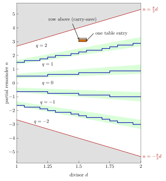

# SRT
This divides two numbers using the SRT algorithm (with radix 4).
It is inspired by this analysis:
[https://www.righto.com/2024/12/this-die-photo-of-pentium-shows.html](https://www.righto.com/2024/12/this-die-photo-of-pentium-shows.html)

## The algorithm
Like long division by hand, SRT division produces the quotient one digit at a
time. Each iteration does:
```
q := PLA(n, d)      -- select quotient digit
n := 4*(n - q*d)    -- update partial remainder
```
Here $d$ is the divisor, and $n$ is the partial remainder, which starts out as
the dividend $N$. Both are normalized first, so $1 \le d < 2$ and
$1 \le N < 2$ (or $N = 0$).

### Radix 4 and the redundant digits
Radix 4 means that each iteration produces one base-4 digit of the quotient.
So the quotient gains two bits per iteration, and the partial remainder is
multiplied by 4, i.e. shifted two bits to the left. After $K$ iterations the
quotient is
```math
q = \sum_{k=0}^{K-1} q_k \, 4^{-k},
```
where $q_k$ is the digit selected in iteration $k$. Here $K = 34$.

Ordinary base-4 digits would be $\{0, 1, 2, 3\}$. SRT instead uses the digits
$\{-2, -1, 0, 1, 2\}$. There are five of them, so storing a digit takes three
bits (a sign and a two-bit magnitude), even though each digit only contributes
a factor of 4 to the quotient. This digit set is *redundant*: many quotients
can be written in more than one way, e.g. $1.5 = 1 + 2 \cdot 4^{-1} = 2 - 2 \cdot 4^{-1}$.
This has two advantages:
* The multiples $q \cdot d$ are $0$, $\pm d$, and $\pm 2d$, which are just shifts
  of $d$. The digit 3 would require calculating $3d$.
* The digit does not have to be chosen exactly, see below.

In this design the magnitudes of the positive and the negative digits are
shifted into two separate registers (`res_p` and `res_n`), two bits per
iteration, and these are subtracted only once at the end.

### Why the partial remainder stays bounded
**Claim:** If $|n| \le \frac{8}{3}d$, then there is a digit $q$ such that the
next partial remainder $n' = 4(n - qd)$ also satisfies $|n'| \le \frac{8}{3}d$.

**Proof:** $|n'| \le \frac{8}{3}d$ is the same as $|n - qd| \le \frac{2}{3}d$,
i.e.
```math
\left(q - \tfrac{2}{3}\right) d \;\le\; n \;\le\; \left(q + \tfrac{2}{3}\right) d .
```
For $q = -2, \ldots, 2$ these five intervals each have length $\frac{4}{3}d$,
and their centres are $d$ apart, so neighbouring intervals overlap. Together
they cover exactly $-\frac{8}{3}d \le n \le \frac{8}{3}d$. So whenever
$|n| \le \frac{8}{3}d$, at least one digit keeps the bound. Initially
$|n| = N < 2 \le \frac{8}{3}d$, so by induction the bound holds in every
iteration. $\blacksquare$

The constant $\frac{8}{3}$ is the largest bound that can be kept: If
$n > \frac{8}{3}d$, then even the largest digit $q = 2$ gives
$n' = 4(n - 2d) > n$, so the partial remainder keeps growing.

The bound also shows that the quotient is correct. Unrolling the iterations
gives $n_K = 4^K (N - q d)$, so
```math
\left| \frac{N}{d} - q \right| = \frac{|n_K|}{4^K d} \le \frac{8}{3} \cdot 4^{-K},
```
which is $\frac{2}{3}$ of the weight of the last digit. This is what the
formal verification checks.

### Why 7 bits of n and 4 bits of d
The overlap between neighbouring intervals is what allows the table to look at
only the top bits of $n$ and $d$. Both digit $k$ and digit $k+1$ are allowed in
the band
```math
\left(k + \tfrac{1}{3}\right) d \;\le\; n \;\le\; \left(k + \tfrac{2}{3}\right) d ,
```
which is $\frac{d}{3}$ high (green in the diagram below). The table sees $n$
rounded down to a multiple of $\Delta n$, and $d$ rounded down to a multiple of
$\Delta d$. So each table entry covers a small rectangle, $\Delta n$ high and
$\Delta d$ wide, and it must hold a digit that is allowed in the whole
rectangle. The boundary between the entries holding $k$ and $k+1$ is therefore
a staircase, which must stay inside the band.

Consider one column of the table, $d_0 \le d < d_0 + \Delta d$, and a
boundary with $k \ge 0$ (negative $k$ are symmetric). The entries
holding $k+1$ must lie above the band's lower edge, which in this column
reaches $\left(k + \frac{1}{3}\right)(d_0 + \Delta d)$. The entries holding
$k$ must lie below the band's upper edge, which in this column is at least
$\left(k + \frac{2}{3}\right) d_0$. The step must be at a multiple of
$\Delta n$ between these two values, and such a multiple always exists if the
gap between them is at least $\Delta n$. The gap is smallest for $d_0 = 1$ and
$k = 1$ (and, by symmetry, $k = -2$), which gives the condition
```math
\Delta n + \tfrac{4}{3} \Delta d \le \tfrac{1}{3} .
```
So the numbers of bits are a trade-off: a finer resolution of $d$ allows a
coarser resolution of $n$, and vice versa. With 4 bits of $d$ after the
leading one, $\Delta d = \frac{1}{16}$, and so $\Delta n \le \frac{1}{4}$ is
enough. This design uses $\Delta n = \frac{1}{8}$, i.e. 3 fractional bits,
which leaves a margin: $\frac{1}{8} + \frac{1}{12} = \frac{5}{24} < \frac{1}{3}$.
The other 4 of the 7 bits are the sign and 3 integer bits, which are needed
because the bound allows $|n|$ up to $\frac{8}{3} \cdot 2 = \frac{16}{3}$ (in
practice it stays below 4.5, see below).

The condition is sufficient, but not necessary: depending on how the steps
line up with the grid, even fewer bits can work. `srt.py` checks the actual
table. Other designs have made other choices; the analysis linked above
mentions that the MIPS R3010 used 9 bits of the partial remainder and 9 bits of
the divisor.

The Pentium uses the same 7 + 4 bits, but it keeps the partial remainder in
carry-save form (a sum and a carry), to avoid a carry-propagating addition in
each iteration. To get the table index, it adds the top 7 bits of the sum and
the carry with a small carry-lookahead adder. Since the lower bits are ignored,
the index can be one entry too low, i.e. the estimate of $n$ can be off by up
to $2\Delta n$. The condition then becomes
$2\Delta n + \frac{4}{3}\Delta d \le \frac{1}{3}$, which 7 + 4 bits satisfy
with equality: $\frac{2}{8} + \frac{4}{3} \cdot \frac{1}{16} = \frac{1}{4} + \frac{1}{12} = \frac{1}{3}$.
So the condition only just guarantees that a correct table exists. In practice
the steps line up well with the grid: in every column there is a multiple of
$\frac{1}{8}$ strictly inside the allowed range, and the smallest margin is
$\frac{1}{48}$ (for $d$ between $\frac{17}{16}$ and $\frac{9}{8}$, between the
digits $-2$ and $-1$). This design calculates $n$ exactly in every iteration,
so its table has more precision than it needs.

### The Pentium FDIV bug
In the Pentium this table was implemented as a PLA. The table's unused
entries held 0. In 1994 Intel stated that the FDIV bug was caused by five
entries that were omitted from the table. The analysis linked above shows
that in fact 16 entries were missing, along the top edge of the $q = 2$
region: they should have held 2, but held 0. Its explanation is that the table
was generated with the wrong bound line for that edge. To allow for the
carry-save estimate, some of the bound lines must be moved down by
$\frac{1}{8}$, namely those where this makes the allowed region smaller. The
top edge is not one of them, but it was moved down anyway. Only five of the 16
missing entries affect the result, and because of the carry-save adder even
these are only reached in about 1 in 9 billion random divisions.

### The table


The diagram shows the table in `pla.vhd`. The horizontal axis is the divisor
$d$, and the vertical axis is the partial remainder $n$.
* The red lines are the bound $|n| = \frac{8}{3}d$. The grey regions outside
  them are never reached.
* In the green bands, two neighbouring digits are both allowed.
* The blue staircases are the boundaries between the digits that the table
  selects. They stay inside the green bands. The table selects the digit by
  rounding $n/d$ to the nearest integer, so the steps follow the lines
  $n = (k + \frac{1}{2}) d$, near the middle of the bands.
* The orange rectangle is a single table entry, $\frac{1}{16}$ wide and
  $\frac{1}{8}$ high.

The staircases are generated from the table by `./srt.py --tikz`, and the
diagram is built from `pla.tex` with `make pla.svg`.

## Files
| File             | Description
| ---------------- | -----------
| `srt_float.vhd`  | Top level. Divides two unsigned integers, returns a 32.32 fixed-point quotient.
| `normalizer.vhd` | Shifts dividend and divisor into the range [1, 2).
| `div.vhd`        | The SRT divider itself. Operates on normalized values.
| `pla.vhd`        | The quotient digit selection table.
| `shifter.vhd`    | Shifts the quotient back to undo the normalization.
| `tb_srt.vhd`     | Testbench for `srt_float`.
| `div.psl`, `div.sby` | Formal verification of `div`.
| `div.gtkw`       | GTKWave setup for viewing the formal verification traces.
| `srt.xpr`, `srt.xdc` | Vivado project (Artix-7 xc7a200tfbg484-2) and timing constraint (200 MHz), for synthesis.
| `srt.py`         | Bit-exact model of `srt_float`, and a checker for the quotient digit table.
| `pla.tex`, `pla_steps.tex`, `pla.svg` | Diagram of the quotient digit table.

## Interface of `srt_float`
* `n_i`, `d_i`: Unsigned integers. They must be less than 2^29, and `d_i` must
  be non-zero. In simulation, an assertion reports invalid inputs when a
  division is started.
* `q_o`: The quotient `n_i/d_i`, with 32 integer bits and 32 fractional bits,
  rounded to nearest.
* Pulse `start_over_i` for one clock cycle to start a division. The inputs are
  only sampled in that clock cycle.
* `busy_o` is high while the division is in progress. When it returns low,
  `q_o` is valid. A division takes 37 clock cycles.

## Number format
Internally (in `div.vhd` and `pla.vhd`) the values are two's complement with 4
integer bits (including the sign). The inputs to `div` are normalized so the
top nibble is `0001`, i.e. they are in the range [1, 2). The partial remainder
`n` then stays in the range [-4, 4.5), as shown by the formal verification.

## Formal verification
The formal verification (`div.psl`, `div.sby`) checks `div` with `G_SIZE=16`
for all normalized inputs, including a zero dividend:
* The partial remainder stays within its bounds, and never overflows.
* The quotient `q_o` matches the digits chosen by the PLA.
* The quotient is correct: it differs from the exact value n/d by less than
  2/3 of its least significant bit.

SMT solvers are slow at multiplication, so instead of calculating q*d directly,
`div.psl` tracks q*d alongside the divider using only additions, and checks a
few invariants in every clock cycle. See the comments in `div.psl`.

Bounded model checking is sufficient, because every division starts from a
state that depends only on the inputs, and the depth covers a complete
division.

## Running
* `make sim` (the default) runs the testbench. It checks a number of edge cases
  (zero dividend, the largest inputs, and every normalization shift), and then
  all divisions n/d with 1 <= n, d <= 1000. The expected results are calculated
  exactly, including the rounding. This requires
  [GHDL](https://github.com/ghdl/ghdl). It takes about 15 minutes.
* `make debug` runs only the first 10 us of the testbench (about 25 divisions),
  and writes a waveform to `srt.ghw`. Use `make show_debug` to view it in
  GTKWave.
* `make formal` runs the formal verification. This requires
  [SymbiYosys](https://github.com/YosysHQ/sby), the GHDL plugin for Yosys, and
  the [Yices 2](https://github.com/SRI-CSL/yices2) solver. The BMC task takes
  about 25 minutes.
  Use `make show_bmc` or `make show_cover` to view the traces in GTKWave.
* `make model` (or `./srt.py`) checks the quotient digit table, and tests the
  model. See below.
* `make clean` removes the generated files.

## The model
`srt.py` is a bit-exact model of `srt_float`, written in Python using
integers. It builds the quotient digit table the same way as `pla.vhd`, so
it calculates exactly the same quotient as the VHDL, including when the table is
modified.

* `./srt.py` checks every entry of the table: For all values of n and d that
  map to the entry, and that satisfy |n/d| < 8/3, the next partial remainder
  must satisfy this too. This check is slightly conservative: some entries near
  the edge are never used. It then tests over 100000 divisions against the
  exact result.
* `./srt.py 1 3 --trace` calculates 1/3, and shows the partial remainder and
  quotient digit of each iteration.
* `./srt.py --remove 3.0:1.5` removes a table entry (sets it to zero, like the
  missing entries in the Pentium). It shows which entries now fail the check,
  and searches for divisions that give a wrong result. Use
  `--remove=-2.5:1.0` for a negative n.

The search works backwards from the table entry to the dividend, because some
table entries may be used by very few divisions. In the Pentium, only about
one in nine billion random divisions reached a missing entry. In this table,
all the entries that are used at all are used often enough that random testing
finds them too.

## Links
* [http://degiorgi.math.hr/aaa_sem/Div/925-934.pdf](http://degiorgi.math.hr/aaa_sem/Div/925-934.pdf)
* [https://en.wikipedia.org/wiki/Division_algorithm#SRT_division](https://en.wikipedia.org/wiki/Division_algorithm#SRT_division)
* [https://www.ardent-tool.com/CPU/Intel/fdiv/white11.pdf](https://www.ardent-tool.com/CPU/Intel/fdiv/white11.pdf)
* [https://people.cs.vt.edu/~naren/Courses/CS3414/assignments/pentium.pdf](https://people.cs.vt.edu/~naren/Courses/CS3414/assignments/pentium.pdf)

